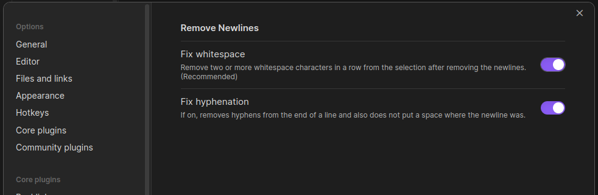

# Remove Newlines

## Core Features
+ Adds two (sorely needed) actions to Obsidian.md:
  1. Remove newlines from text (optionally remove word-break hyphenation and fix consecutive whitespace issues)
  2. Remove blank lines from text
+ The actions accept input from wherever you might have text:
  1. Selected in the editor
  2. From your clipboard (while pasting)
+ The actions can be run any way you find most convenient:
  1. Right-click menu (context menu)
  2. Keyboard shortcuts (hotkeys)
  3. Command Palette

## Usage

### Paste without newlines

### Remove newlines from text selection

### Paste without blank lines

### Remove blank lines from text selection

### Change Settings
You can change how Remove Newlines handles word-break hyphenation and consecutive whitespace (when removing newlines) by visiting the plugin's settings tab.

### Adding Hotkeys
There are no hotkeys for these actions by default, but you can create them in the settings modal under the "Hotkeys" section.

## What's New?
### 1.0.5
- Added the ability to remove blank lines from the context menu and the command palette.

### 1.0.4
- Fixed a bug where invoking plugin actions from command palette did not work, and added newlines at the top of the file.
- Added support for `CR`, `LF`, and/or `CR LF` line endings.

### 1.0.3
- Added ability to remove newlines from text selection in the Obsidian editor.
- Addeded ability to paste content without newlines into the Obsidian editor.

## Installing
### Via the Community Plugin Manager
1. Open the Community Plugins tab of your Obsidian's settings modal.
2. Click the "Browse" button under "Community Plugins".
2. Search for "Remove Newlines".
3. Click "Install" on the plugin page, then "Enable".

### Via URI/Browser
1. Visit the official [plugin page](https://obsidian.md/plugins?id=remove-newlines#) on Obsidian's plugin repository.
2. Click "Install".
3. Allow the site to open the obsidian link via Obsidian.
4. Click "Install" on the plugin page, then "Enable".

### Manually
1. Download the [latest release](https://github.com/HandcartCactus/obsidian-remove-newlines/releases) of the plugin.
2. Create a `remove-newlines` folder in your vault's `plugins/` directory: `<YourVaultFolder>/.obsidian/plugins/remove-newlines`
3. Unzip the release file and copy over `main.js`, `styles.css`, and `manifest.json` into the `remove-newlines/` folder you created in step 2.

## Report Issues
If you encounter any issues, please report them on the [issue tracker](https://github.com/HandcartCactus/obsidian-remove-newlines/issues/new?assignees=HandcartCactus&labels=bug&projects=&template=bug_report.md&title=%5BBUG%5D) for this plugin.

## Request Features
If you'd like to request a feature or have an idea for a new feature, please use the GitHub [issue tracker](https://github.com/HandcartCactus/obsidian-remove-newlines/issues/new?assignees=HandcartCactus&labels=enhancement&projects=&template=feature_request.md&title=%5BFEATURE%5D).

## Inspection
All relevant source code can be found in [`main.ts`](https://github.com/HandcartCactus/obsidian-remove-newlines/blob/main/main.ts). To compile yourself from source:
1. clone this repo
2. `cd` to the project folder
3. run `npm run dev` or `npm run build`
4. perform a manual install
