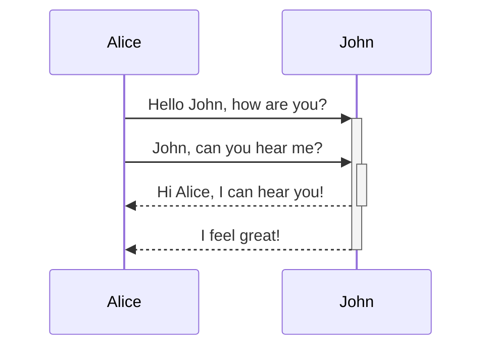
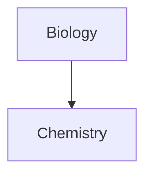

This is a [[link]] to another note. This is a [[link|with text]] #^this-paragraph

![[embedded link]]

![[Link#^id]] 

this paragraph has an ^id

[^id] this is a footnote

%%this is a comment%%

~~this is a strikethrough~~

==this is a highlight==

\*\*This line will not be bold\*\*

\**This line will be italic and show the asterisks*\*

[Obsidian Help](https://help.obsidian.md)

[My Note](obsidian://open?vault=MainVault&file=My%20Note.md)

[My Note](<obsidian://open?vault=MainVault&file=My Note.md>)


```python
import this

print("this is some code")


print("dont remove these blank lines?")


```

      tabbed code block
      tabbed code block

      tabbed code block

> Human beings face ever more complex and urgent problems, and their effectiveness in dealing with these problems is a matter that is critical to the stability and continued progress of society.

\- Doug Engelbart, 1961

---

hsep section

---

# heading1

## heading2

###### heading6


task list:
- [ ] Task 1
- [x] Task 2

> [!info] Callout
> This is a callout block

- First list item
- Second list item
- Third list item

1. First list item
2. Second list item
3. Third list item

1) First list item
2) Second list item
3) Third list item

1. First list item
   
2. Second list item
3. Third list item
   
4. Fourth list item
5. Fifth list item
6. Sixth list item

- [x] This is a completed task.
- [ ] This is an incomplete task.

- [x] Milk
- [?] Eggs
- [-] Eggs

1. First list item
   1. Ordered nested list item
2. Second list item
   - Unordered nested list item

- [ ] Task item 1
	- [ ] Subtask 1
- [ ] Task item 2
	- [ ] Subtask 1

hrules:

***

****

* * *

---

----

- - -

___

____

_ _ _


Text inside `backticks` on a line will be formatted like code.

`````
cd ~/Desktop
`````

~~~
cd ~/Desktop
~~~

    cd ~/Desktop

`````js
function fancyAlert(arg) {
  if(arg) {
    $.facebox({div:'#foo'})
  }
}
`````

````md
Here's how to create a code block:
```js
console.log("Hello world")
```
````

````md
```dataviewjs
dv.paragraph(`
~~~mermaid
graph TD
    A --> B
~~~
`)
```
````

This is a simple footnote[^1].

[^1]: This is the referenced text.
[^2]: Add 2 spaces at the start of each new line.
  This lets you write footnotes that span multiple lines.
[^note]: Named footnotes still appear as numbers, but can make it easier to identify and link references.

You can also use inline footnotes. ^[This is an inline footnote.]

This is an %%inline%% comment.

%%
This is a block comment.

Block comments can span multiple lines.
%%

1\. This won't be a list item.

\*This text will not be italicized\*.


| First name | Last name |
| ---------- | --------- |
| Max        | Planck    |
| Marie      | Curie     |


First name | Last name
-- | --
Max | Planck
Marie | Curie


First column | Second column
-- | --
[[Basic formatting syntax\|Markdown syntax]] | ![[Engelbart.jpg\|200]]


Left-aligned text | Center-aligned text | Right-aligned text
:-- | :--: | --:
Content | Content | Content






$$
\begin{vmatrix}a & b\\
c & d
\end{vmatrix}=ad-bc
$$

This is an inline math expression $e^{2i\pi} = 1$.

This is a paragraph.

This is another paragraph.

Multiple          adjacent          spaces


and multiple newlines between paragraphs.

Single return with no spaces: A single Enter with no trailing spaces will combine the two separate lines into a single line when rendered.

line one
line two

| Style                  | Syntax                 | Example                                  | Output                                 |
| ---------------------- | ---------------------- | ---------------------------------------- | -------------------------------------- |
| Bold                   | `** **` or `__ __`     | `**Bold text**`                          | **Bold text**                          |
| Italic                 | `* *` or `_ _`         | `*Italic text*`                          | _Italic text_                          |
| Strikethrough          | `~~ ~~`                | `~~Striked out text~~`                   | ~~Striked out text~~                   |
| Highlight              | `== ==`                | `==Highlighted text==`                   | ==Highlighted text==                   |
| Bold and nested italic | `** **` and `_ _`      | `**Bold text and _nested italic_ text**` | **Bold text and _nested italic_ text** |
| Bold and italic        | `*** ***` or `___ ___` | `***Bold and italic text***`             | **_Bold and italic text_**             |


[Three laws of motion](Three%20laws%20of%20motion.md)

<div>
This **will not** be bold and this `will not` be code.
</div>

HTML blocks must be complete and cannot contain blank lines within them. Blank lines will break the HTML block.

<table>
<tr>
<td>Content here</td>
</tr>
</table>

<table>

<tr>

<td>Content here</td>

</tr>

</table>


> [!info] Here's a callout title
> Here's a callout block.
> It supports **Markdown**, [[Internal link|Wikilinks]], and [[Embed files|embeds]]!
> ![[Engelbart.jpg]]

1.  List item one.

    List item one continued with a second paragraph followed by an
    Indented block.

        $ ls *.sh
        $ mv *.sh ~/tmp

    List item continued with a third paragraph.

2.  List item two continued with an open block.

    This paragraph is part of the preceding list item.

    1. This list is nested and does not require explicit item continuation.

       This paragraph is part of the preceding list item.

    2. List item b.

    This paragraph belongs to item two of the outer list.

setext headings:

Foo *bar*
=========

Foo *bar*
---------

